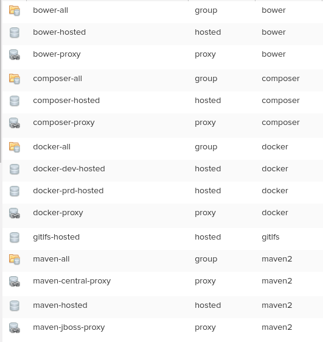

# Playbook para configurar repositórios no nexus em uma imagem docker

## Clone
```bash
$ git clone https://github.com/marcosborges/ansible-role-plx-nexus-in-docker.git
```

## Configure
Edit ansible-role-plx-nexus-in-docker/defaults/main.yml. Replace nexus_default_port, nexus_default_context_path and nexus_admin_password with your Nexus configure. 


## Run
```bash
$ cd ansible-role-plx-nexus-in-docker
$ ./run.sh
```





